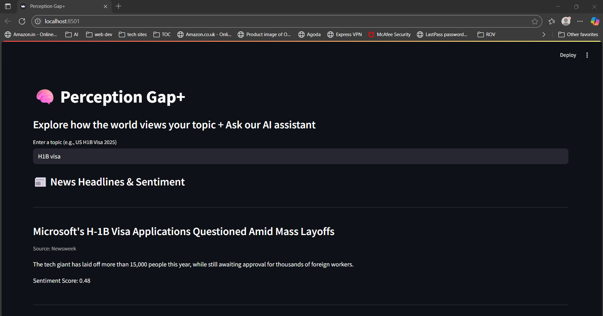
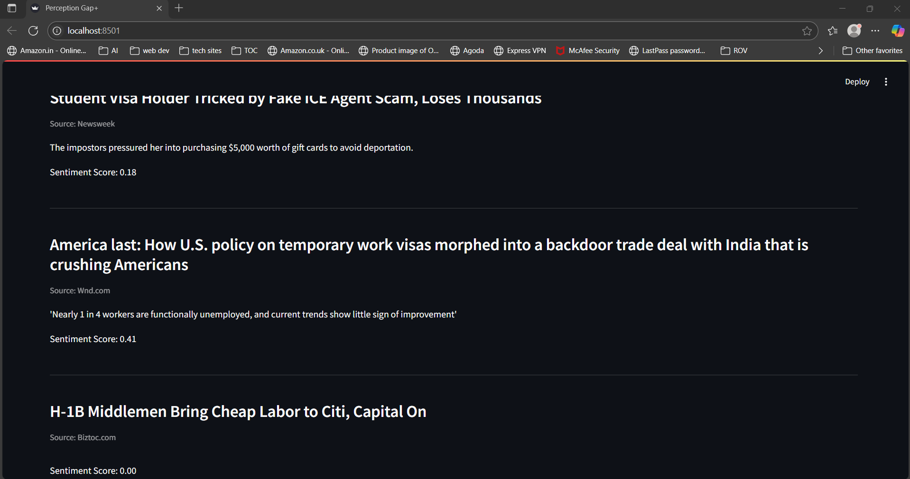
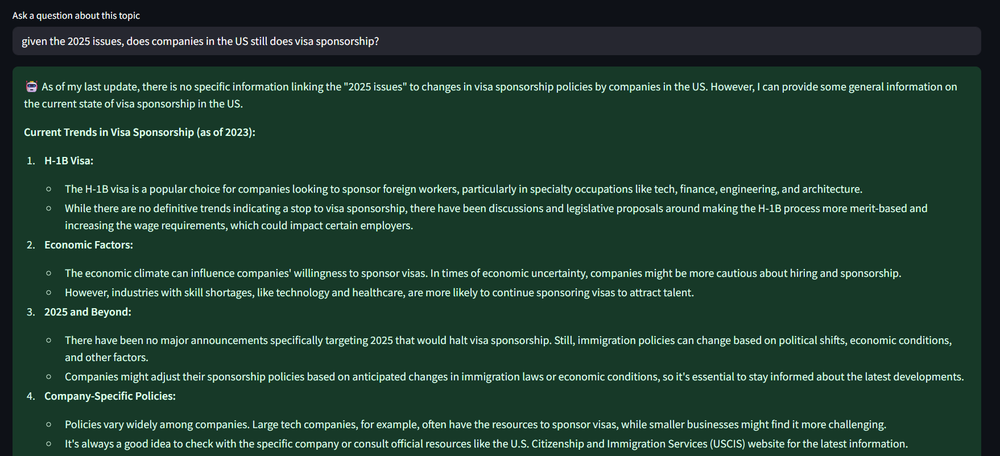

# 🧠 Perception Gap+

> **“See the world differently — one story at a time.”**

Perception Gap+ is an AI-powered web application that helps users explore different **perspectives, sentiments, and trends** on any topic — and engage with a smart chatbot to ask **context-aware questions** based on real-world data.

Built for **Call2Code 2025 Hackathon**, this project demonstrates the power of combining:
- Real-time news & trends,
- Sentiment analysis, and
- Open-source LLM reasoning

## 🚀 Features (Early Prototype)

### ✅ 1. Real-Time Topic Input
Users can enter any topic such as EX: 
- BTS current news
- US H1B Visa 2025
- AI replacing jobs

### ✅ 2. News + Sentiment Dashboard
- Fetches news headlines using **NewsAPI**
- Analyzes each article’s sentiment using **VADER**
- Displays both the **headline + sentiment score**

### ✅ 3. Smart AI Chat Assistant
- Powered by **Mistral 3.2 24B Instruct (via OpenRouter)**
- Users can ask **follow-up questions** about the topic
- AI responds with **context-aware** insights using public knowledge

### ✅ 4. Streamlit-Powered UI
The entire early prototype is built using **Streamlit** for rapid development and clean layout.

- Real-time input + output flow
- Minimal UI with expandable architecture
- Fast iteration + easy deployment

> ✅ This version is **Semi working and ready for demo**!

---

## 🛠️ Tech Stack

| Layer        | Tech                                   |
|--------------|----------------------------------------|
| 🧠 LLM        | Mistral 3.2 24B (via OpenRouter)       |
| 📰 News Fetch | NewsAPI                                |
| 🧪 Sentiment  | VADER (via `vaderSentiment`)           |
| 🎨 Frontend   | Streamlit (early prototype)            |
| 🧠 Auth/Keys  | `.env` + `python-dotenv`               |
| 🛠 Backend    | Pure Python (modular architecture)     |

---

| Model                                           | Host                | Purpose                  |
| ----------------------------------------------- | ------------------- | ------------------------ |
| mistralai/mistral-small-3.2-24b-instruct-2506   | OpenRouter          | Smart contextual replies |
| VADER                                           | Local (HuggingFace) | Sentiment scoring        |
| NewsAPI                                         | NewsAPI.org         | Real-time news headlines |

## Final Frontend (Coming Soon)
The full designed UI/UX and frontend (React/Vue) will be revealed in the final presentation round.

It will include:
-Sidebar navigation
-Multi-page views
-Better visualizations (radar charts, timeline, etc.)
-Shareable insights

🔧 Current build is a prototype demonstrating the core AI functionality.

## 📷 Demo Screenshots

### 🧠 Topic Input
The user begins by entering a topic of interest into the search bar. This input serves as the foundation for all subsequent insights the app provides. Upon submission, the system queries multiple public data sources — starting with NewsAPI — to collect relevant articles in real-time. This intuitive and minimal interface encourages exploration, allowing users to investigate any subject, from global events to niche communities like "BTS current news" or "US H1B Visa 2025". The entered topic also becomes the context for both sentiment analysis and the AI chatbot, creating a seamless research experience.

### 📰 News + Sentiment Output
Once a topic is entered, the application pulls the most recent and relevant headlines using NewsAPI. Each article is analyzed using VADER (Valence Aware Dictionary for Sentiment Reasoning), a lightweight NLP tool that returns a sentiment score ranging from -1 (very negative) to +1 (very positive). This section displays not only the headlines and sources but also clearly indicates the emotional tone of each article. It allows users to quickly detect whether public and media narratives are generally supportive, neutral, or critical — enabling a deeper understanding of bias and perception.

### 💬 Chatbot Response
The AI assistant lets users ask contextual and personalized questions about the topic they explored. For instance, after reading about Rosé’s solo performance or BTS’s chart rankings, a user might ask, “Which songs from BTS have stayed longest on Billboard?” The assistant is powered by Mistral 3.2 24B Instruct via OpenRouter — a modern open-source LLM optimized for reasoning and instruction following. It responds with intelligent, human-like explanations based on general world knowledge and the provided topic. This turns passive research into an interactive conversation, bridging the gap between data and decision-making.

